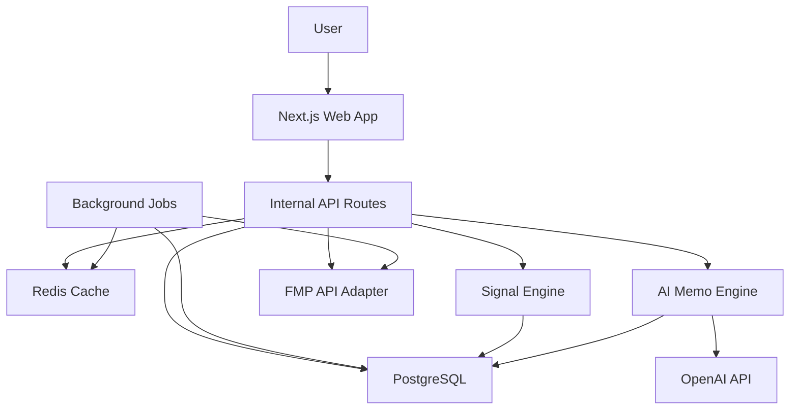

# ThesisLens Technical Design

## 1. System Overview

ThesisLens is a U.S. equity research web application that consumes Financial Modeling Prep (FMP) data, normalizes it into an internal evidence model, computes deterministic investment signals, and uses AI to generate grounded research memos.

The architecture should optimize for:

- Fast company page load.
- Controlled FMP API usage.
- Reproducible scoring.
- Evidence-backed AI output.
- Extensibility for watchlists, screeners, alerts, and future FMP Ultimate datasets.

High-level flow:

1. User searches for a U.S. ticker.
2. App fetches cached company snapshot.
3. Missing or stale data is refreshed through the FMP adapter.
4. Normalized data is stored in Postgres and/or cache.
5. Signal engine computes scores and insight cards.
6. AI memo engine receives a curated facts payload.
7. Company page renders deterministic modules plus AI commentary.

## 2. Recommended Tech Stack

### 2.1 Application

- Framework: Next.js with App Router.
- Language: TypeScript.
- Styling: Tailwind CSS.
- UI primitives: Radix UI or shadcn/ui.
- Charts: ECharts or Recharts.
- Tables: TanStack Table.

### 2.2 Backend

- Runtime: Node.js.
- API layer: Next.js Route Handlers or separate Fastify service if complexity grows.
- Database: PostgreSQL.
- ORM: Prisma or Drizzle.
- Cache: Redis.
- Background jobs: BullMQ, Inngest, Trigger.dev, or pg-boss.
- Scheduled refresh: cron-backed job runner.

### 2.3 AI

- AI provider: OpenAI API.
- Pattern: server-side generation only.
- Storage: memo result persisted with input facts hash.
- Safety: grounded prompt with evidence IDs and output schema.

### 2.4 Deployment

Good MVP options:

- Vercel for Next.js.
- Supabase or Neon for Postgres.
- Upstash Redis or managed Redis.
- Background worker on Fly.io, Render, Railway, or separate Vercel cron plus queue.

If heavier background jobs are needed, prefer a long-running worker environment over serverless-only execution.

## 3. Architecture Diagram



## 4. Core Modules

### 4.1 FMP Adapter

Purpose:

- Centralize all FMP endpoint calls.
- Normalize request parameters.
- Enforce rate limits.
- Track endpoint permissions and failures.
- Convert FMP responses into internal normalized records.

Responsibilities:

- `searchSymbols(query)`
- `getCompanyProfile(symbol)`
- `getQuote(symbol)`
- `getFinancialStatements(symbol, period)`
- `getKeyMetrics(symbol)`
- `getRatios(symbol)`
- `getFinancialScores(symbol)`
- `getOwnerEarnings(symbol)`
- `getEnterpriseValues(symbol)`
- `getFinancialGrowth(symbol)`
- `getAnalystEstimates(symbol)`
- `getPriceTargets(symbol)`
- `getRatings(symbol)`
- `getDcf(symbol)`
- `getNews(symbol)`
- `getPressReleases(symbol)`
- `getSecFilings(symbol)`
- `getInsiderTrades(symbol)`
- `getCongressTrades(symbol)`
- `getTechnicalIndicators(symbol, indicator, timeframe)`
- `getPeers(symbol)`
- `getSectorIndustryContext(...)`

Implementation requirements:

- Every FMP call goes through one adapter.
- Each endpoint has a typed response schema.
- Use runtime validation with Zod for critical endpoints.
- Store endpoint status and last error.
- Log API latency and response size.
- Support stale-while-revalidate.

### 4.2 Data Normalization Layer

Purpose:

- Convert inconsistent endpoint responses into stable app models.
- Preserve raw response snapshots when useful.
- Generate evidence IDs for downstream signals and AI.

Normalized concepts:

- Company.
- Quote.
- FinancialStatement.
- MetricPoint.
- RatioPoint.
- GrowthPoint.
- ValuationPoint.
- AnalystEstimate.
- RatingEvent.
- PriceTargetPoint.
- NewsItem.
- PressRelease.
- SecFiling.
- InsiderTransaction.
- CongressionalTransaction.
- TechnicalIndicatorPoint.
- PeerSnapshot.
- Signal.
- Evidence.
- AiMemo.

### 4.3 Signal Engine

Purpose:

- Generate deterministic scores and insight cards before AI.
- Make the product useful even if AI is disabled.

Signal families:

- Quality.
- Growth.
- Profitability.
- Balance sheet.
- Cash flow.
- Valuation.
- Expectations.
- Momentum/technical.
- Event risk.
- Insider/congressional behavior.

Output shape:

```ts
type Signal = {
  id: string;
  symbol: string;
  category:
    | "quality"
    | "growth"
    | "profitability"
    | "balance_sheet"
    | "cash_flow"
    | "valuation"
    | "expectations"
    | "technical"
    | "events"
    | "behavior";
  direction: "positive" | "negative" | "neutral" | "mixed";
  severity: "low" | "medium" | "high";
  confidence: number; // 0-1
  title: string;
  summary: string;
  evidenceIds: string[];
  computedAt: string;
};
```

### 4.4 Evidence Model

Purpose:

- Prevent AI hallucination.
- Let users inspect why a claim was made.
- Enable memo regeneration with a facts hash.

Evidence shape:

```ts
type Evidence = {
  id: string;
  symbol: string;
  source:
    | "fmp_profile"
    | "fmp_quote"
    | "fmp_financial_statement"
    | "fmp_key_metrics"
    | "fmp_ratios"
    | "fmp_financial_scores"
    | "fmp_owner_earnings"
    | "fmp_enterprise_values"
    | "fmp_analyst_estimates"
    | "fmp_price_target"
    | "fmp_rating"
    | "fmp_news"
    | "fmp_press_release"
    | "fmp_sec_filing"
    | "fmp_insider"
    | "fmp_congress"
    | "computed_signal";
  label: string;
  value: string | number | boolean | null;
  unit?: string;
  period?: string;
  timestamp?: string;
  url?: string;
  metadata?: Record<string, unknown>;
};
```

### 4.5 AI Memo Engine

Purpose:

- Generate concise, evidence-backed research memos.
- Summarize rather than predict.

Pipeline:

1. Gather normalized facts.
2. Select most relevant evidence.
3. Generate deterministic pre-summary.
4. Build LLM prompt.
5. Request structured JSON output.
6. Validate output.
7. Persist memo and facts hash.
8. Render memo with evidence references.

Output schema:

```ts
type AiMemo = {
  symbol: string;
  generatedAt: string;
  factsHash: string;
  executiveSummary: string;
  whatChanged: MemoSection;
  businessQuality: MemoSection;
  valuation: MemoSection;
  expectations: MemoSection;
  catalystsAndRisks: MemoSection;
  behaviorSignals: MemoSection;
  bullCase: MemoSection;
  bearCase: MemoSection;
  keyQuestions: string[];
  evidenceIds: string[];
};

type MemoSection = {
  summary: string;
  evidenceIds: string[];
  confidence: "low" | "medium" | "high";
};
```

AI guardrails:

- The system prompt forbids direct investment advice.
- The user prompt contains only selected facts and evidence IDs.
- The model must use evidence IDs for claims.
- Post-processing rejects sections without evidence when evidence is required.
- UI labels memo as informational research, not advice.

## 5. Data Refresh Strategy

### 5.1 Cache Classes

Different datasets have different refresh cadences:

| Data type | Example | Suggested TTL |
| --- | --- | --- |
| Real-time quote | quote, quote-short | 30-120 seconds |
| Profile | company profile | 7 days |
| Financial statements | income/balance/cashflow | 12-24 hours |
| Ratios/key metrics | ratios, key metrics | 12-24 hours |
| Analyst estimates | analyst estimates, price targets | 6-12 hours |
| News/press releases | stock news, press releases | 5-15 minutes |
| SEC filings | latest filings, 8-K | 15-60 minutes |
| Insider/congress | insider, house/senate trades | 1-6 hours |
| Technical indicators | SMA/RSI/etc. | 5-60 minutes depending timeframe |
| Sector/industry context | sector performance, PE | 1-6 hours |

### 5.2 Stale-While-Revalidate

Company page should:

- Return cached data immediately if available.
- Show freshness timestamps.
- Trigger background refresh for stale modules.
- Avoid blocking the whole page on slow endpoints.

Current implementation:

- PostgreSQL `company_research_snapshots` is the serving snapshot and outage fallback.
- PostgreSQL `company_data_modules` stores freshness independently for profile, quote,
  fundamentals, financial scores, valuation, expectations, news, SEC filings,
  insider transactions, congressional transactions, technicals, peers, and calendar.
- PostgreSQL `data_sync_jobs` is a durable priority queue with retry attempts,
  exponential backoff, and stale-running-job recovery.
- A normal page visit returns the persisted snapshot first and only enqueues expired
  modules. A cold symbol loads profile and quote synchronously, then queues deeper data.
- The worker prioritizes watchlist symbols, rotates through one system-universe batch
  per cycle, groups claimed jobs by symbol, and merges refreshed modules into the
  previous snapshot.
- Failed module refreshes preserve the prior value and are presented as stale instead
  of replacing objective data with examples.

### 5.3 API Rate and Bandwidth Control

FMP Premium constraints:

- 750 API calls/minute.
- 50GB trailing 30-day bandwidth limit.

Controls:

- Global FMP request queue.
- Per-endpoint concurrency limits.
- Response compression/storage optimization.
- Avoid fetching all modules on first load if not visible.
- Persist normalized data instead of repeatedly pulling raw endpoints.
- Precompute top watchlist data in background.

## 6. Database Design

Below is a practical MVP schema. Exact field names can evolve after seeing live FMP payloads.

### 6.1 Core Tables

#### companies

- id
- symbol
- name
- cik
- exchange
- sector
- industry
- country
- currency
- description
- website
- ceo
- image_url
- ipo_date
- is_active
- created_at
- updated_at

Indexes:

- unique(symbol)
- index(name)
- index(cik)
- index(sector, industry)

#### quotes

- id
- symbol
- price
- change
- change_percent
- volume
- market_cap
- day_low
- day_high
- year_low
- year_high
- timestamp
- fetched_at

Indexes:

- index(symbol, fetched_at)

#### financial_statements

- id
- symbol
- statement_type
- period
- fiscal_year
- fiscal_period
- date
- reported_currency
- data_json
- fetched_at

Indexes:

- unique(symbol, statement_type, period, fiscal_year, fiscal_period)

#### metric_points

- id
- symbol
- metric_type
- metric_name
- value
- unit
- period
- fiscal_year
- fiscal_period
- date
- source
- fetched_at

Indexes:

- index(symbol, metric_type, metric_name, date)

#### analyst_estimates

- id
- symbol
- period
- fiscal_year
- fiscal_period
- data_json
- fetched_at

#### ratings_events

- id
- symbol
- rating_type
- rating
- score
- firm
- action
- date
- data_json
- fetched_at

#### price_targets

- id
- symbol
- target_high
- target_low
- target_mean
- target_median
- consensus
- date
- data_json
- fetched_at

#### news_items

- id
- symbol
- title
- publisher
- published_at
- url
- image_url
- summary
- raw_json
- fetched_at

#### sec_filings

- id
- symbol
- cik
- form_type
- filing_date
- accepted_date
- report_date
- title
- url
- raw_json
- fetched_at

#### insider_transactions

- id
- symbol
- reporting_name
- role
- transaction_type
- transaction_date
- filing_date
- shares
- price
- value
- ownership_type
- source_url
- raw_json
- fetched_at

#### congressional_transactions

- id
- symbol
- chamber
- representative_name
- party
- state
- transaction_type
- transaction_date
- filing_date
- amount_min
- amount_max
- asset_description
- raw_json
- fetched_at

### 6.2 Signal and AI Tables

#### evidence

- id
- symbol
- source
- label
- value_string
- value_number
- unit
- period
- timestamp
- url
- metadata_json
- created_at

#### signals

- id
- symbol
- category
- direction
- severity
- confidence
- title
- summary
- score
- evidence_ids
- computed_at

#### company_scores

- id
- symbol
- score_type
- score
- label
- drivers_json
- evidence_ids
- computed_at

#### ai_memos

- id
- symbol
- model
- facts_hash
- memo_json
- evidence_ids
- generated_at
- created_by_user_id

### 6.3 User Tables

#### users

- id
- email
- name
- created_at
- updated_at

#### watchlists

- id
- user_id
- name
- created_at
- updated_at

#### watchlist_items

- id
- watchlist_id
- symbol
- notes
- created_at

#### saved_theses

- id
- user_id
- symbol
- title
- thesis_text
- status
- created_at
- updated_at

## 7. Internal API Design

### 7.1 Public App APIs

#### GET /api/search

Query:

- `q`: string

Returns:

- List of matching U.S. equities.

#### GET /api/stocks/:symbol/snapshot

Returns:

- Company header data.
- Score summary.
- Top signals.
- Freshness metadata.

#### GET /api/stocks/:symbol/fundamentals

Returns:

- Financial charts.
- Metrics.
- Quality score.
- Evidence.

#### GET /api/stocks/:symbol/valuation

Returns:

- Valuation metrics.
- Historical percentiles.
- Peer comparison.
- DCF.
- Valuation score.

#### GET /api/stocks/:symbol/expectations

Returns:

- Analyst estimates.
- Ratings.
- Price targets.
- Revision signals.

#### GET /api/stocks/:symbol/events

Returns:

- Earnings/dividends/splits.
- News.
- Press releases.
- SEC filings.
- Ranked timeline.

#### GET /api/stocks/:symbol/behavior

Returns:

- Insider trades.
- Insider statistics.
- Congressional trades.
- Behavior score.

#### POST /api/stocks/:symbol/memo

Body:

- `forceRefresh?: boolean`

Returns:

- AI memo.

### 7.2 Admin/Internal APIs

#### POST /api/internal/refresh/:symbol

Refreshes selected modules for a symbol.

#### POST /api/internal/recompute/:symbol

Recomputes scores and signals.

#### GET /api/internal/fmp-health

Shows endpoint health, rate usage, failures, and access issues.

## 8. Frontend Design

### 8.1 Dashboard

Purpose:

- Daily entry point.

Sections:

- Market overview.
- Watchlist changes.
- Important events.
- Interesting research candidates.
- Recently generated memos.

### 8.2 Company Page

Top layout:

- Header with quote.
- Today conclusion panel.
- Score cards.
- What changed feed.

Tabs:

- Overview.
- Fundamentals.
- Valuation.
- Expectations.
- Events.
- Insider & Congress.
- Technicals.
- Peers.
- Filings.
- AI Memo.

Design principles:

- Dense but readable.
- Avoid marketing hero sections.
- Avoid nested cards.
- Show evidence links inline.
- Show freshness timestamps.

### 8.3 Signal Card Component

Props:

```ts
type SignalCardProps = {
  title: string;
  summary: string;
  category: string;
  direction: "positive" | "negative" | "neutral" | "mixed";
  severity: "low" | "medium" | "high";
  confidence: number;
  evidence: Evidence[];
};
```

### 8.4 Score Card Component

Props:

```ts
type ScoreCardProps = {
  label: string;
  score: number;
  status: "strong" | "good" | "mixed" | "weak";
  drivers: Array<{
    label: string;
    direction: "positive" | "negative" | "neutral";
    value: string;
  }>;
};
```

## 9. Scoring Engine Design

### 9.1 General Score Normalization

Scores should be:

- 0-100.
- Percentile-aware when possible.
- Winsorized to avoid extreme outliers.
- Sector-aware for valuation and margin metrics.
- Time-aware for growth and revisions.

### 9.2 Quality Score Inputs

Potential components:

- Revenue CAGR.
- Gross margin stability.
- Operating margin trend.
- Net margin trend.
- ROE/ROIC/ROA.
- Free cash flow margin.
- Owner earnings trend.
- Debt/equity.
- Net debt/EBITDA where available.
- Current ratio.
- Interest coverage where available.
- Share count dilution.
- Piotroski score.
- Altman Z-score.

### 9.3 Valuation Score Inputs

Potential components:

- P/E.
- Forward P/E if estimate-derived.
- EV/EBITDA.
- P/S.
- P/B.
- FCF yield.
- DCF upside/downside.
- Historical percentile.
- Peer percentile.
- Sector/industry PE.
- Market risk premium and treasury context.

### 9.4 Expectations Score Inputs

Potential components:

- EPS estimate revisions.
- Revenue estimate revisions.
- Price target revision.
- Ratings and grades trend.
- Estimate change relative to price change.

### 9.5 Event Risk Score Inputs

Potential components:

- Days to earnings.
- Recent SEC filing count.
- 8-K presence.
- News/press release spike.
- Abnormal price/volume.
- Recent insider/congressional activity.

### 9.6 Behavior Signal Inputs

Potential components:

- Insider purchase value.
- Insider sale value.
- Insider role weight.
- Clustered transactions.
- Congressional transaction value/range.
- Transaction recency.

## 10. AI Memo Design

### 10.1 Facts Payload

The memo generator receives an object like:

```ts
type MemoFacts = {
  company: {
    symbol: string;
    name: string;
    sector?: string;
    industry?: string;
    description?: string;
  };
  quote: Record<string, unknown>;
  scores: CompanyScore[];
  signals: Signal[];
  financialHighlights: Evidence[];
  valuationHighlights: Evidence[];
  expectationHighlights: Evidence[];
  eventHighlights: Evidence[];
  behaviorHighlights: Evidence[];
  peerHighlights: Evidence[];
  riskHighlights: Evidence[];
};
```

### 10.2 Prompt Requirements

System instructions:

- You are an equity research assistant.
- Use only the provided facts.
- Do not recommend buying, selling, or holding.
- Distinguish facts from interpretation.
- Every important claim must include evidence IDs.
- If evidence is insufficient, say so.

### 10.3 Memo Regeneration

Use `facts_hash`:

- If facts hash unchanged, return cached memo.
- If facts changed, allow regeneration.
- Store model version and prompt version.

### 10.4 AI Cost Control

- Generate memo on demand in MVP.
- Cache generated memos.
- Use smaller model for short "what changed" summaries.
- Use larger model only for full investment memo.

## 11. Security and Compliance

### 11.1 API Keys

- Store FMP API key server-side only.
- Never expose keys in browser.
- Use environment variables:
  - `FMP_API_KEY`
  - `AUTH_SECRET`
  - `ADMIN_PASSPHRASE`
  - `INTERNAL_API_TOKEN`
  - `DATABASE_URL`
  - `REDIS_URL`

### 11.2 Access Control

Current implementation uses an admin passphrase plus dynamic access-code gate:

- Browser access is protected by a signed HttpOnly `thesislens_session` cookie.
- `/login`, `/api/auth/login`, `/api/auth/logout`, and `/api/health` are public.
- Other pages and user-facing API routes require a valid signed session.
- Admins enter with `ADMIN_PASSPHRASE` and can rebuild time-limited access codes.
- Access-code sessions have viewer permissions and cannot enter `/admin` or `/api/admin/*`.
- Viewer session expiry never exceeds the originating access-code expiry.
- Login attempts are rate-limited through Redis with an in-memory fallback.
- `/api/internal/*` only accepts `x-internal-token`; viewer and admin cookies do not bypass it.
- The worker token additionally has read-only access to `/api/watchlist` and `/api/universes`.
- Public HTTPS deployments should set `AUTH_SECURE_COOKIES=true`.

Future multi-user releases should replace the single-admin environment model with persisted users, password hashes or an external identity provider, role-based access control, audit logs, and per-user data ownership.

### 11.3 Licensing

FMP pricing notes that displaying or redistributing FMP data may require a specific Data Display and Licensing Agreement. Before public launch:

- Review FMP terms.
- Confirm display rights.
- Avoid raw data export.
- Add source attribution where required.

### 11.4 Legal Disclaimers

App must clearly state:

- Information is for research and education.
- Not investment advice.
- Data may contain inaccuracies or delays.
- Rule-based summaries may be incomplete and should be independently verified.

### 11.5 User Data

- Encrypt secrets.
- Use the single-admin gate only for private deployments.
- Avoid storing brokerage credentials in MVP.
- Store minimal personal data.

## 12. Observability

Track:

- FMP endpoint latency.
- FMP status codes.
- FMP rate usage.
- FMP bandwidth estimate.
- Cache hit rate.
- Background job failures.
- AI generation success/failure.
- AI token usage.
- Page load metrics.
- Signal computation errors.

Recommended tools:

- Structured logs.
- Sentry for frontend/backend errors.
- PostHog or Plausible for product analytics.
- Database job run table for refresh audit.

## 13. Testing Strategy

### 13.1 Unit Tests

- FMP adapter response mapping.
- Score calculations.
- Evidence generation.
- Prompt payload creation.

### 13.2 Integration Tests

- Search endpoint.
- Company snapshot endpoint.
- Refresh pipeline.
- AI memo generation with mocked model.

### 13.3 Fixture Tests

Maintain fixture payloads for:

- Mega-cap tech stock.
- Bank.
- Energy company.
- Biotech with negative earnings.
- Recently IPO'd company.
- Delisted or missing-data company.

### 13.4 UI Tests

- Company page renders with complete data.
- Company page renders with missing modules.
- AI memo citations display.
- Error and loading states.

## 14. Implementation Plan

### Phase 0: Project Setup

- Next.js app.
- TypeScript.
- ESLint/Prettier.
- Tailwind.
- Database setup.
- Environment config.

### Phase 1: FMP Foundation

- Build FMP adapter.
- Implement search.
- Implement profile and quote.
- Add Redis caching.
- Add endpoint health logging.

### Phase 2: Company Page Skeleton

- Header.
- Overview layout.
- Basic chart.
- Freshness metadata.
- Error states.

### Phase 3: Fundamentals and Valuation

- Financial statements.
- Key metrics.
- Ratios.
- Scores.
- Owner earnings.
- Enterprise values.
- DCF.
- Initial quality and valuation scoring.

### Phase 4: Expectations and Events

- Analyst estimates.
- Ratings and price targets.
- News.
- Press releases.
- Earnings/dividends/splits calendar.
- SEC filings.

### Phase 5: Signals

- Evidence model.
- Score drivers.
- Insight cards.
- What changed feed.

### Phase 6: AI Memo

- Facts payload.
- Prompt and schema.
- Memo persistence.
- Evidence rendering.

### Phase 7: Insider/Congress

- Insider trades and statistics.
- House/Senate trades.
- Behavior signal module.

### Phase 8: Watchlist MVP

- User auth.
- Watchlist CRUD.
- Watchlist change feed.

## 15. Access Validation Checklist

Before finalizing endpoint coverage, use the actual FMP Premium API key to test:

- Company profile.
- Quote.
- Historical EOD full.
- Intraday intervals: 5min, 15min, 30min, 1hour, 4hour.
- Financial statements annual/quarter.
- Ratios and key metrics.
- Financial scores.
- Owner earnings.
- Analyst estimates.
- Price targets.
- Ratings and grades.
- DCF and custom DCF.
- SEC filings.
- Insider trading.
- Senate and House endpoints.
- ETF holdings access.
- 13F access.
- Earnings transcripts access.
- Bulk endpoints access.

Record results in a future `docs/FMP_ACCESS_MATRIX.md`.

## 16. Future Architecture Extensions

### 16.1 Ultimate Data Layer

If FMP access expands:

- 13F ingestion.
- ETF/MF holdings.
- Earnings transcript ingestion.
- Transcript AI analysis.
- Institutional ownership change signals.

### 16.2 Portfolio Intelligence

- User holdings.
- Portfolio-level quality/valuation/risk.
- Earnings calendar across holdings.
- Concentration risk.
- Thesis drift alerts.

### 16.3 Alert Engine

Alert types:

- Estimate revision.
- New SEC filing.
- Insider purchase.
- Congressional trade.
- Price/technical threshold.
- Valuation percentile threshold.
- Earnings approaching.

### 16.4 Backtesting Research Screens

Potential future:

- Track historical signal performance.
- Evaluate whether signal combinations would have been useful.
- Avoid presenting backtests as guaranteed future returns.

## 17. Key Technical Risks

1. FMP endpoint access may differ from docs.

   Mitigation: Create access matrix and dynamic feature flags.

2. API cost and bandwidth may grow quickly.

   Mitigation: Cache aggressively and refresh by module cadence.

3. AI may hallucinate.

   Mitigation: Evidence-only prompt, JSON schema, post-validation, source IDs.

4. Financial scoring can be misleading across sectors.

   Mitigation: Sector-aware comparisons and visible score drivers.

5. SEC/news relevance ranking may be noisy.

   Mitigation: Start with deterministic form/type rules, improve with feedback.

6. Public data display may require licensing.

   Mitigation: Confirm FMP display terms before launch.
